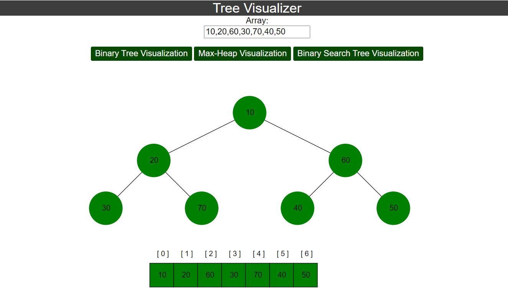

# Tree-Visualizer

Click here for a <a target="_blank" href=""> DEMO </a>

A binary tree visualizer is a powerful tool that provides a graphical representation of binary tree data structures. It offers a visual depiction of the tree's nodes, branches, and hierarchy, making it easier for users to understand and manipulate the structure.

These visualizers often come with features such as interactive interfaces that allow users to create, modify, and traverse binary trees effortlessly. They may provide different visualization styles, including traditional tree diagrams, animated traversals, or even 3D representations, catering to various learning preferences and needs.

One of the primary benefits of a binary tree visualizer is its ability to aid in debugging and understanding algorithms and data structures. By visualizing the tree's structure and operations, programmers can gain insights into how their code behaves, identify potential errors, and optimize performance.

Moreover, binary tree visualizers are invaluable tools for teaching and learning purposes. They facilitate hands-on exploration of abstract concepts, helping students grasp fundamental principles of computer science and algorithm design. With the ability to interactively manipulate trees, learners can experiment with different scenarios, solidifying their understanding through active engagement.

In addition to educational and debugging uses, binary tree visualizers also find applications in fields such as data analysis, decision-making processes, and network routing algorithms. By visually representing hierarchical relationships, these tools enable users to analyze and interpret complex data sets more intuitively, leading to informed decision-making and problem-solving.
